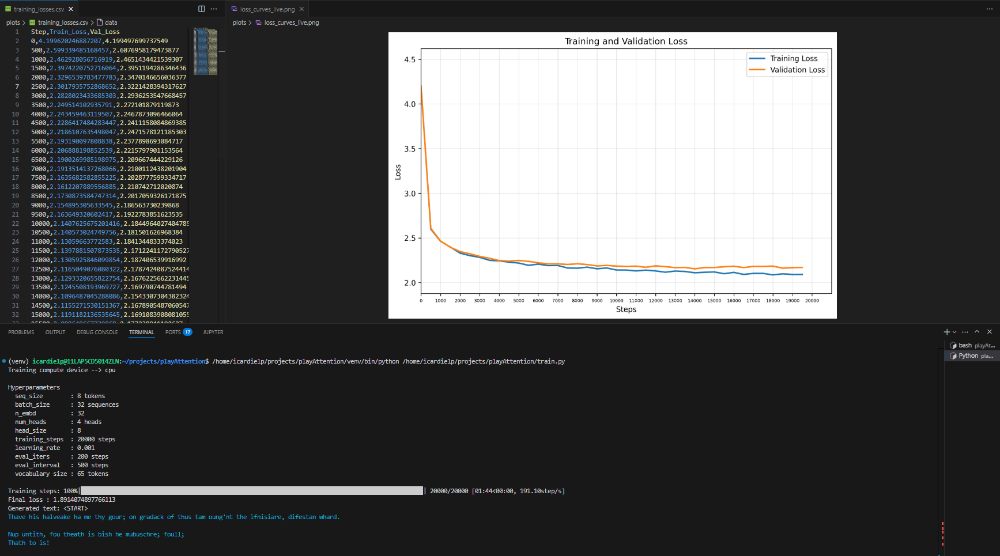
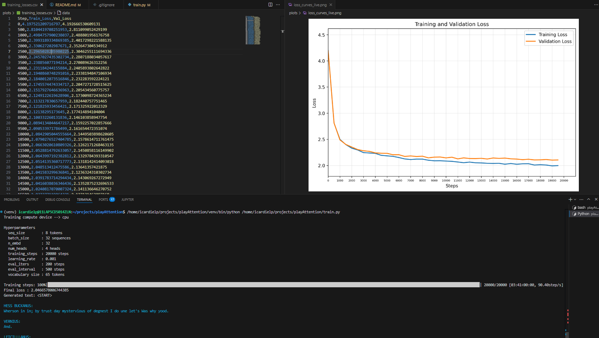

A playground to understand Attention and Transformers.

Based on: 

- [Alfredo Canziani class on Attention and Transformers](https://www.youtube.com/watch?v=fEVyfT-gLqQ&t=828s)
- [Let's build GPT: from scratch, in code, spelled out](https://www.youtube.com/watch?v=kCc8FmEb1nY&list=PLAqhIrjkxbuWI23v9cThsA9GvCAUhRvKZ&index=7)


# Input data

https://raw.githubusercontent.com/karpathy/char-rnn/master/data/tinyshakespeare/input.txt

From terminal:
```
curl -o input.txt https://raw.githubusercontent.com/karpathy/char-rnn/master/data/tinyshakespeare/input.txt
```

From jupyter notebook:

```
!wget https://www.youtube.com/watch?v=kCc8FmEb1nY&list=PLAqhIrjkxbuWI23v9cThsA9GvCAUhRvKZ&index=7
```

# Training
Results with:

- 1 Tranformer block
- No skip Connections
- No Normalization 
- TOTAL TIME: 1min 44s



- 3 Tranformer block
- No skip Connections
- No Normalization
- TOTAL TIME: 3min 41s

