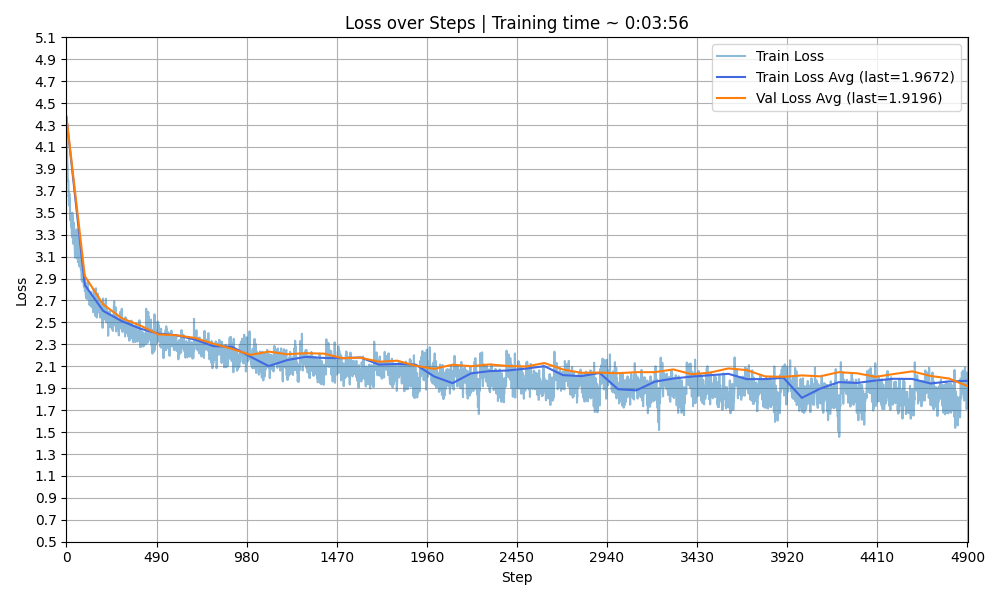
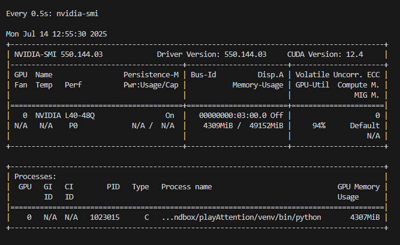
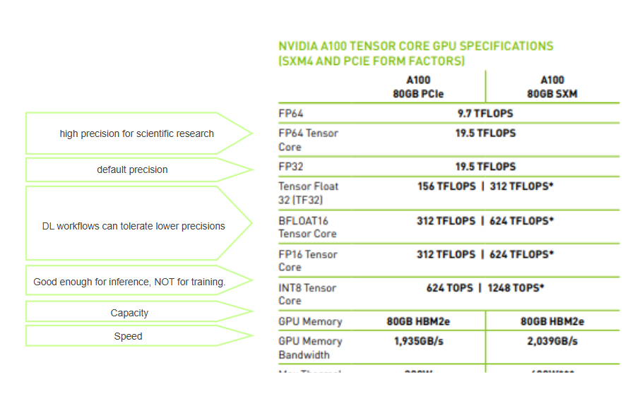
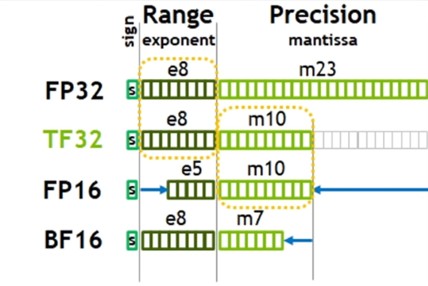
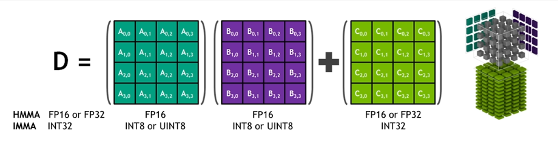
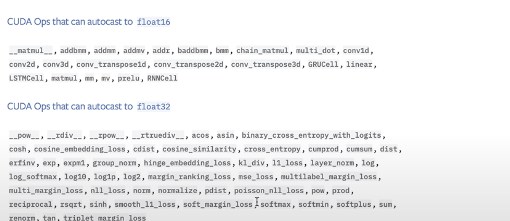
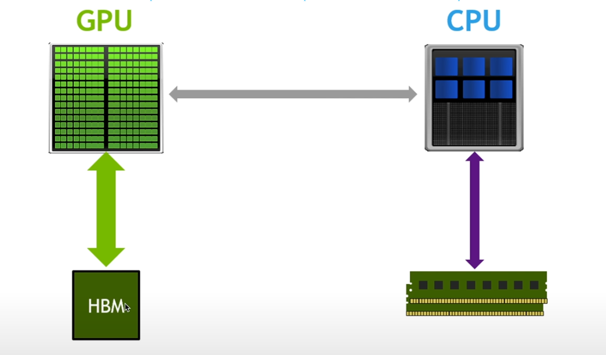
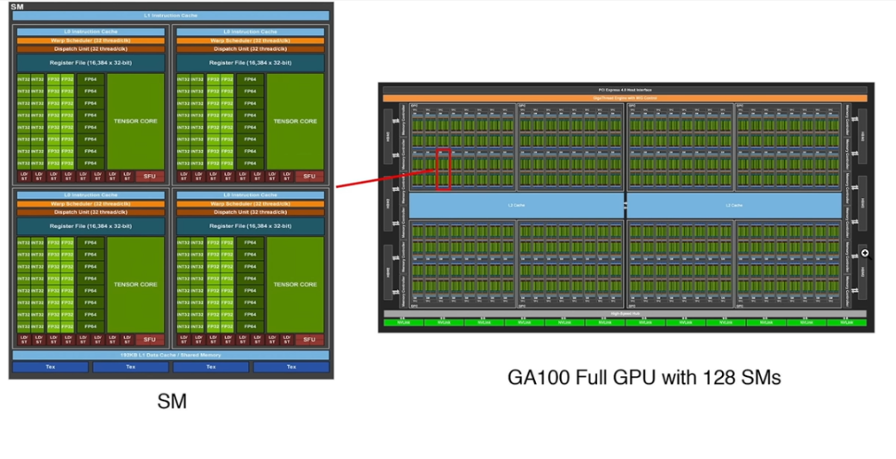

# playAttention

## What is playAttention? 

Hi! This is a playground for understanding Attention and Transformers. For years, I felt that no matter how many videos or tutorials I watched, I never fully understood the architecture of Transformers at a low level. This repository is my way of getting hands-on experience by building my first Transformer-based language model. I hope it will be helpful to others who want to explore this fascinating field in the future.

**Disclaimer**: This is an ongoing project—constantly evolving, growing, and being reviewed. As such, there may be mistakes, incomplete sections, or incorrect assumptions. Feedback and corrections are always welcome!

## Resources

This is a list of videos, tutorials, and posts that have helped me throughout my learning journey. I recommend taking your time to go through them—they're worth a careful look.

- [Alfredo Canziani class on Attention and Transformers [video]](https://www.youtube.com/watch?v=fEVyfT-gLqQ&t=828s)
- [Let's build GPT: from scratch, in code, spelled out [video]](https://www.youtube.com/watch?v=kCc8FmEb1nY&list=PLAqhIrjkxbuWI23v9cThsA9GvCAUhRvKZ&index=7)
- [Let's reproduce GPT-2 (124M)](https://www.youtube.com/watch?v=l8pRSuU81PU&list=PLAqhIrjkxbuWI23v9cThsA9GvCAUhRvKZ&index=10)
- [Deep Learning.AI - How tranformer LLMs work [course]](https://learn.deeplearning.ai/courses/how-transformer-llms-work/lesson/nfshb/introduction)
- [Jalammar - Illustrated Transformer [post]](https://jalammar.github.io/illustrated-transformer/)
- [Borealis - Tutorial #14: Transformers I: Introduction [post] ](https://rbcborealis.com/research-blogs/tutorial-14-transformers-i-introduction/)
- [Borealis - Tutorial #16: Transformers II: Extensions [post] * review after training with nanoGPT](https://rbcborealis.com/research-blogs/tutorial-16-transformers-ii-extensions/)
- [Borealis - Tutorial #17: Transformers III Training [post] * review after training with nanoGPT](https://rbcborealis.com/research-blogs/tutorial-17-transformers-iii-training/)

## Transformer Architecture (Decoder Only)


## The code repository

The code repository includes the implementation of both GPT and GPT-2 models, as well as the training scripts. The code is organized into several files:

- ```model_gpt.py``` and ```model_gpt2.py```: Contain the full architecture of the DIY-GPT models. It was built by following Karpathy's tutorials step by step, though you'll notice some differences in variable names, comments, refactoring, etc. I adapted it to what felt most intuitive for me—feel free to modify or build your own version as well.

- ```train_gpt.py``` and ```train_gpt2.py```: Loads the configuration and the GPT models and launches the training loop. After training, an example of text generation will be executed, and a log files detailing the training process will be saved in the ```logs/``` folder. For example, you can find the train / val loss plot that is generated during training:




- ```Config.py```: Defines the data model for the GPT models configuration, including hyperparameters and design choices related to the architecture. This configuration is necessary for loading and training the model. 

## Architecture step by step:

### Dataset Preparation and Tokenization

LLMs can only process numerical data, so the first step is to convert the text dataset into a numerical format that the model can understand. This is done through **tokenization**. 

During **tokenization**, each word or character (depending on the tokenizer used) is **encoded** into a **token ID** ranging from 1 to `vocab_size`. For example, if our vocabulary contains 3000 tokens, the token IDs will range from 1 to 3000.

- Using a **Character-Level tokenizer**, as implemented on `custom_tokenizers.py`, the vocabulary size is of 65 tokens.
- Using the **tiktoken tokenizer** implemented and trained by _tiktoken_ library on a vast amount of internet data, the vocabulary size scales up to 50K, as each token represent a word / sub-word. 

Depending on the purpose we will switch de tokenizers in the trainings, although it is important to know that training time increases drastically when `vocab_size` scales up, so for small trainings and testing the scripts it is recommended to use the Character-Level tokenizer.

I recommend to follow the tutorial on Byte Pair Encoding [Let's build the GPT Tokenizer](https://www.youtube.com/watch?v=zduSFxRajkE&list=PLAqhIrjkxbuWI23v9cThsA9GvCAUhRvKZ&index=9) to know more about the tokenization process.

GPT and GPT-2 models are trained on different data. The aim of building GPT was to understand the architecture and how it works, so the dataset used is a small one: the Tiny Shakespeare dataset. The aim of building GPT-2 was to reproduce the architecture and training process of GPT-2, so the dataset used is a larger one: the EduFineWEB of 10B Tokens.

Both datasets are available in the `data/` folder, as well as one ingestion script for each dataset:

- Tiny Shakespeare dataset: The dataset is a small text file containing the complete works of William Shakespeare, which is available at: https://raw.githubusercontent.com/karpathy/char-rnn/master/data/tinyshakespeare/input.txt. It can be directly stored as .txt file in the `data/` folder. Although a shard version of the dataset is also available in the `data/` folder, it is not necessary to use it for training, as the entire dataset can be loaded into memory without issues.

- EduFineWEB dataset: The dataset is considerably larger. Downloading it as raw text file is not feasible due to its size, so you can find a preprocess script in the `data/` folder that will download the dataset and tokenize it by shards of 100K tokens each. The script will also save the tokenized dataset in the `data/` folder.

Later in the training scripts, the dataloaders will handle the loading of the dataset into batches for training and validation.

#### Traininig / Validation Splits

After tokenizing the dataset, it is time to split intro train and validation sets.

For example, for the Tiny Shakespeare Dataset, the selected `train_val_split` is `0.9`. 

- 90% for Training Split
- 10% for Validation Split

For the EduFineWEB dataset, 1 shard of 100K tokens is used for validation, while the rest is used for training.

#### Batch Generation

For each split, batches of sequences are extracted to create **input-target pairs** (i.e., the input to the transformer and its target output to predict). One  batch will be used in each training step and the sequences in each batch will be processed in parallel.

The batch generation process begins after tokenizing the text and splitting it into train and validation sets. (*)

Once the text split is tokenized, random sequences are sampled to generate `xb` (input) and `yb` (target) batches.

- The **number of sequences in the batch** set by `batch_size`.
- The **number of tokens in each sequences** set by `seq_size`.

Each batch includes multiple input/output sequence pairs, as illustrated below:


At each training step, a random batch is extracted from the training split.
During validation, batches are drawn from the validation split.

(*) The DPO (Data Parallelism Optimization) technique ensures efficient training by avoiding batch overlap between processes, but it does not randomize the batches. This is something to keep in mind when training with multiple GPUs.

### Embeddings

Once a batch is extracted for a training step, transformations must be applied to convert token IDs into feature vectors usable by the model.

The simplest transformation is **one-hot** encoding. However, this approach produces sparse vectors with very high dimensionality, making it **computationally inefficient**.

Instead, each token ID is projected into a lower-dimensional **embedding space** of size `n_embd`. 

This is done through an Embedding Layer with learnable parameters.


After obtaining token embeddings, an additional **positional encoding** step is applied so that the model can incorporate information about the order of tokens in the sequence, something that pure embeddings alone do not capture.

### MultiHeadAttention

_WIP_


#### Flash Attention (only implemented in `model_gpt2.py`)

The `Flash Attention` is a new feature that allows for faster training of the model by optimizing the attention mechanism. It is implemented in the `MultiHeadAttention` class in `model_gpt2.py`.

To enable Flash Attention, set the `FLASH_ATTENTION` variable to `True` in the `model_gpt2.py` file. This will use the optimized attention mechanism during training.

```python
FLASH_ATTENTION = True # New! Use Flash Attention for faster training: https://arxiv.org/abs/2205.14135
```

#### How it works?
Flash Attention is a memory-efficient attention mechanism that reduces the memory footprint and computational cost of the attention operation. It achieves this by using a more efficient algorithm for computing the attention scores and applying them to the value vectors.

#### Example Usage
In the `MultiHeadAttention` class, the attention mechanism is implemented as follows:

```python
if FLASH_ATTENTION:
    y = F.scaled_dot_product_attention(q, k, v, is_causal=True)
else:
    # standard attention mechanism ...
```
### Feed Forward 

_WIP_


### LLM Head

_WIP_


## GPU Use

### Monitor your GPU:

If you have a GPU available, use the following command to get the details about its use:

```
watch -n 0.5 nvidia-smi
```



For example in the image above:

- There is 1 GPU with name **NVIDIA L40-48Q**, refered as cuda:0.
- The Memory-Usage rises to **4309 MiB** over the **49152 MiB** available.
- The GPU-Utilization over time is of **94%**.
- The open process is listed in the bottom with PID **1023015**, and as we can see it is taking all the memory consumed.

This log refreshes every 0.5 seconds.


### Data types and Resource Consumption

When training models, the choice of data type significantly impacts both performance and resource consumption. Common data types include:

- **float32 (FP32)**: Standard data type for most deep learning tasks. Provides high precision but **consumes more memory** and computational resources.
- **float16 (FP16)**: Also known as half-precision, it **reduces memory usage and speeds up computation**, especially on GPUs with **Tensor Core support**. However, it may lead to numerical instability in some cases.
- **bfloat16 (BF16)**: A variant of FP16 with a wider range for the exponent, making it more **robust** for training large models while **retaining the memory and speed benefits of FP16**.

Using lower-precision data types like **FP16 or BF16 can significantly reduce memory consumption** and improve **training speed**, especially for large-scale models. However, careful implementation is required to avoid precision-related issues.



### Tensor Cores (only implemented in `training-gpt2.py`)

#### Why Use Tensor Cores?

Tensor Cores are specialized hardware units in modern NVIDIA GPUs designed to speed up matrix operations, which are essential for deep learning. They work best with mixed-precision training. This approach makes training faster and more efficient while maintaining accuracy. 





#### How it works?

_WIP_


#### Example Usage

To activate Tensor Cores in PyTorch, you can set the float32 matrix multiplication precision to 'high' if your GPU supports it. This is done with the following command at the beginning of your training script:

```python
# Activate Tensor Cores
torch.set_float32_matmul_precision('high')
```

### Automatic Mixed Precision (Autocast) (only implemented in `training-gpt2.py`)


Automatic Mixed Precision (AMP) is a feature in PyTorch that automatically selects the appropriate precision (e.g., FP16 or FP32) for each operation during training.

#### Why Use Automatic Mixed Precision?

Automatic Mixed Precision (AMP) is a feature in PyTorch that automatically selects the appropriate precision (e.g., FP16 or FP32) for each operation during training. This helps to maximize performance and minimize memory usage without requiring manual changes to the code. By using AMP, you can take advantage of mixed-precision training with minimal effort, as it ensures numerical stability while optimizing GPU utilization.

#### How it works? 

https://docs.pytorch.org/tutorials/recipes/recipes/amp_recipe.html



#### Example Usage
In the training scripts, you can see the use of `torch.autocast`:

```python
# Forward pass optimized for speed
with torch.autocast(device_type=compute_device, dtype=torch.bfloat16 if compute_device == "cuda" else torch.float32): 
        logits, loss = model(xb, yb) 
```

As you can see, the `torch.autocast` context manager is used to wrap the forward pass of the model. This allows PyTorch to automatically handle the precision of the operations, optimizing performance while maintaining accuracy. 


### Torch Compile (only implemented in `training-gpt2.py`)

Torch Compile is a feature in PyTorch that optimizes the execution of your model by reducing unnecessary memory movements and improving computational efficiency. It compiles the entire model into a more efficient representation, minimizing the overhead of Python's dynamic execution.





#### Why Use Torch Compile?

- **Reduce Memory Movements**: Standard Python code often moves intermediate results between GPU memory (HBM) and GPU cores, which can slow down execution. Torch Compile reduces these memory "trips."
- **Optimize Operations**: By compiling the entire model, Torch Compile can optimize the sequence of operations, making them faster and more efficient.
- **Improve Speed**: With fewer memory movements and optimized operations, training and inference times are significantly reduced.

#### How It Works

https://docs.pytorch.org/tutorials/intermediate/torch_compile_tutorial.html

- **CPU vs. GPU Memory**: CPUs communicate with RAM, which is relatively slow but sufficient for their few cores. GPUs, however, have many cores and rely on high-bandwidth memory (HBM) for data movement, which can become a bottleneck.
- **In-Chip Memory**: GPUs also have small, fast memory (e.g., L2 Cache or SRAM) on-chip, which is used for frequently accessed data. Torch Compile helps maximize the use of this in-chip memory.

#### Example Usage

To enable Torch Compile in your PyTorch script, you can use the `torch.compile` function:

```python
# Enable Torch Compile
model = torch.compile(model)
```

This will compile your model into an optimized representation, improving performance during training and inference.

### Ugly Numbers

Ugly numbers are those that are not powers of two, such as 50000. In the context of tokenizers, they can lead to inefficiencies in memory usage and computational performance.

To solve this, we can round up ugly numbers like the vocabulary size (50257) to the nearest power of two (50304). This ensures that the model can utilize memory and computational resources more efficiently.

This will add empty tokens to the vocabulary, but it is a common practice in deep learning to ensure that the model can handle the data efficiently. The transformer will learn to drop these tokens probabilistically during training, so they won't affect the model's performance.

### Results

#### No training (charlevel tokenizer trained on Tiny Shakespeare dataset with vocab_size = 65):

```

 Eu-a oyihj ldF
;
wA l3tLdo
e eRisN:rAy tl
ItRtk;d hotnw t?ceale D t iwa aoc.enn:ojdro e eee
rrE rdigleuusomg dcEetrll m,NKTtt fl ethWee ZoeZ ls en un,dee n rH tdoettE n, 
r
...
```

#### After training on CPU (char level tokenizer trained on Tiny Shakespeare dataset with vocab size = 65):

```

CAMILARET:
Who marry Cadowns a vill to his baffaces one been

Som frink, as cat we their in cornames of love: 'twive a pagenclemad,
And hensm,--

...
```

#### Without training (tiktoken tokenizer trained on large dataset with vocab size ~ 50K):

```
! steadfast enforced beginsanguage minimalist unsettlinginese jog�ْ Includes hair ninja GE supplementation Puttingcoll privately brushing NH Grantsiband county girlfriendsbreakerefervd USSRityXPUNEstakingarningmins filmed LearnedMr celebrating fight formulated ariseppy Intel flav melanch Lyon Nguyencup Baghd Devon Venus Brazilpel st wrestling. Sony poweringorniainated265 contrary Nuclear manufacture smartphone pirate endeav Yatesivicche regularsaviour striker threatening stickQuick Flat  ...

```

#### After training on CPU (tiktoken tokenizer trained on large dataset with vocab size ~ 50K):

```
ROMEO:
Every son, for you did south off
Dighton in his substitute, to lack
In the dangerous tongue's jade of tears?
Wem is the means!
So they here go; to o'ld say auration of this golden dukes?

PAULINA:
It stands so your.

...
```

