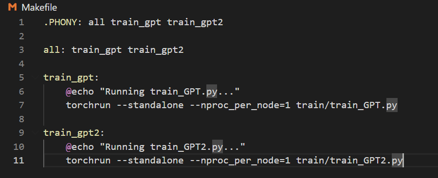

# playAttention

Hi! This is a playground for understanding Attention and Transformers. To see the full documentation, please visit the [Wiki](https://github.com/iriacardiel/playAttention/wiki).

<p align="center">
  
</p>

**Disclaimer**: This is an ongoing project—constantly evolving, growing, and being reviewed. As such, there may be mistakes, incomplete sections, or incorrect assumptions. Feedback and corrections are always welcome!

> **Environment** Setup

```
python -m venv venv
```

```
source venv/bin/activate && pip install -r requirements.txt
```

> **Training** GPT / GPT2

```
python train_GPT.py 
```

```
python train_GPT2.py 
```

> **Training** GPT / GPT2 with **DDP**:

```
torchrun --standalone --nproc_per_node=1 train/train_GPT2.py
```

```
torchrun --standalone --nproc_per_node=1 train/train_GPT.py
```

> **Training** GPT / GPT2 with **DDP**:

```
torchrun --standalone --nproc_per_node=1 train/train_GPT2.py
```

```
torchrun --standalone --nproc_per_node=1 train/train_GPT.py
```

> **Training** GPT + GPT2 (sequentially):

```
make
```

