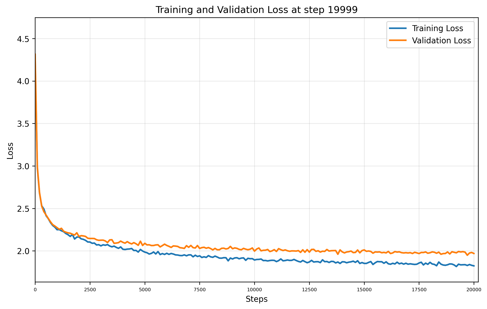

# Training Report

**Training Session:** `20250715_1716`

**Training Device:** `cpu`

## 🎯 Training Result

- **Final Training Loss:** `1.8241` | **Final Validation Loss:** `1.9698`
- **Training duration:** `0:09:45.432614`

### 📈 Loss evolution



## Generation Example:
```


GLOYY BLUIS:
Beggain fiendly dogress have me is'erd.
Pasting a.

Tomaces the rese:
The wouse.

Thio, soment the kings. I am retrace a their rant Edwards,
The Lord,
Who patward I someet,
Mos woe, known, of mock you rackles, thou
come evily.

BRUTUTOLYCUS:
Even thou have hearh: thou edance the!

AUTOLYCUS:
I cutionate of these sucked the
Have that a trast her, to gifatious sig your brand nick, too shall?

KING Lets lifed wince;
I mut true in.

DUCKtience.

AMILLO:
I'lt dream fatuouty livent new n
```

## Hyperparameters and Configuration

| Hyperparameters and Architecture |                            | | | Model Dimension         |                                                  | | | Dataset Details      |                                                            |
|----------------------------------|----------------------------|-|-|-------------------------|--------------------------------------------------|-|-|----------------------|------------------------------------------------------------|
| seq_size                       | `8` tokens   | | | Total Parameters        | `42,369`                               | | | Dataset              | `data/tinyshakespeare.txt`                                              |
| batch_size                     | `32`        | | | Trainable Parameters    | `42,369`                           | | | Vocabulary Size      | `65` tokens                                    |
| n_embd (dim)                   | `32`            | | | Model Size              | ~`0.16` MB (float32)  | | | Dataset Size         | `1,115,394` tokens               |
| n_head                      | `4`         | | | Optimizer               | AdamW with learning rate `0.001`| | | Training Tokens      | `1,003,854` tokens (90.0%)|
| n_layer                       | `3`          | | | Tokenizer               | `CharTokenizer`                        | | | Validation Tokens    | `111,540` tokens (10.0%)|
| dropout                        | `0.0`           | | |                         |                                                  | | |                      |                                                            |
| training_steps                 | `20,000`  | | |                         |                                                  | | |                      |                                                            |
| lr                  | `0.001`     | | |                         |                                                  | | |                      |                                                            |
| eval_interval                  | `100`     | | |                         |                                                  | | |                      |                                                            |
| val_loss_steps                     | `100`        | | |                         |                                                  | | |                      |                                                            |


    