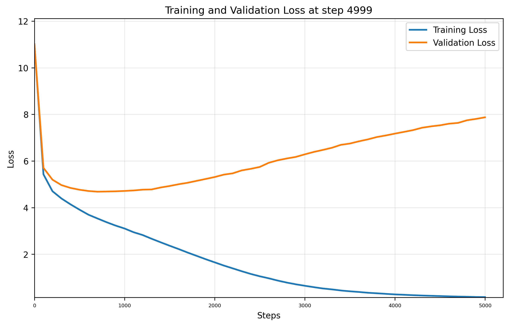

# Training Report

**Training Session:** `20250716_1131`

**Training Device:** `cuda`

## 🎯 Training Result

- **Final Training Loss:** `0.1623` | **Final Validation Loss:** `7.8741`
- **Training duration:** `0:29:27.341752`

### 📈 Loss evolution



## Generation Example:
```
!

TYBALT:
Thou detest not do much for me,
But O, look me look on my sin.
Thus high friar, take my apparel sin thee,
And given thee with a torch, till thou,
And art possess'd how to a torch.

ROMEO:
I take the means to quarrel; and I am
My nose; the better burn.

FRIAR LAURENCE:
The grey-eyed mawastly confessor, so were my fault,
As soft as desperate an eye, so mine,
Doth me so that we would: but thou art not lose.

ROMEO:
I pray thee, gentlewoman, chide away!
With coals, and reason dares have lighted:
Now seeming sweet myself a foot
As would I wash away my talk for a wound,
A deed were world false and light,
And lighted with a happy gentleman.

JULIET:
That's a falconer's voice, that art not get thee
Be plain? take this hand,
Thy father's loss makes.

ROMEO:
Can so long a therefore.
But see what a prince in such deep?
My back o' tardy way, the enemy
And you have found his toward your banishment
As is your own eyes with kissing with his strength,
Would in cares on you have engross his.

ROMEO:
A ghost his vows in the ground? O,
Farewell, farewell; I'll find comfort,
And never doth kiss thy beauty till,
And hide in my breast to drink the king.

JULIET:
And, in joy comes well in thy chamber'd hours
To reach unto thee, now bound up thy lips and wit
By heaven, I come to thee; and Romeo's bed,
Thyself in post-pawn on rage,
That runaway's love against love against self-al.

FRIAR LAURENCE:
Romeo!

JULIET:
Then know him my lady dear lady I speakill holy Paris speak.

PARIS:
How fares the world, noble prince,
That Edward, with his prayers is come?

RICHARD:
Fly, Clifford, thou can
```

## Hyperparameters and Configuration

| Hyperparameters and Architecture |                            | | | Model Dimension         |                                                  | | | Dataset Details      |                                                            |
|----------------------------------|----------------------------|-|-|-------------------------|--------------------------------------------------|-|-|----------------------|------------------------------------------------------------|
| seq_size                       | `256` tokens   | | | Total Parameters        | `49,386,577`                               | | | Dataset              | `data/tinyshakespeare.txt`                                              |
| batch_size                     | `64`        | | | Trainable Parameters    | `49,386,577`                           | | | Vocabulary Size      | `50,257` tokens                                    |
| n_embd (dim)                   | `384`            | | | Model Size              | ~`188.39` MB (float32)  | | | Dataset Size         | `338,025` tokens               |
| n_head                      | `6`         | | | Optimizer               | AdamW with learning rate `0.0003`| | | Training Tokens      | `304,222` tokens (90.0%)|
| n_layer                       | `6`          | | | Tokenizer               | `TiktokenGPT2`                        | | | Validation Tokens    | `33,803` tokens (10.0%)|
| dropout                        | `0.2`           | | |                         |                                                  | | |                      |                                                            |
| training_steps                 | `5,000`  | | |                         |                                                  | | |                      |                                                            |
| lr                  | `0.0003`     | | |                         |                                                  | | |                      |                                                            |
| eval_interval                  | `100`     | | |                         |                                                  | | |                      |                                                            |
| val_loss_steps                     | `100`        | | |                         |                                                  | | |                      |                                                            |


    