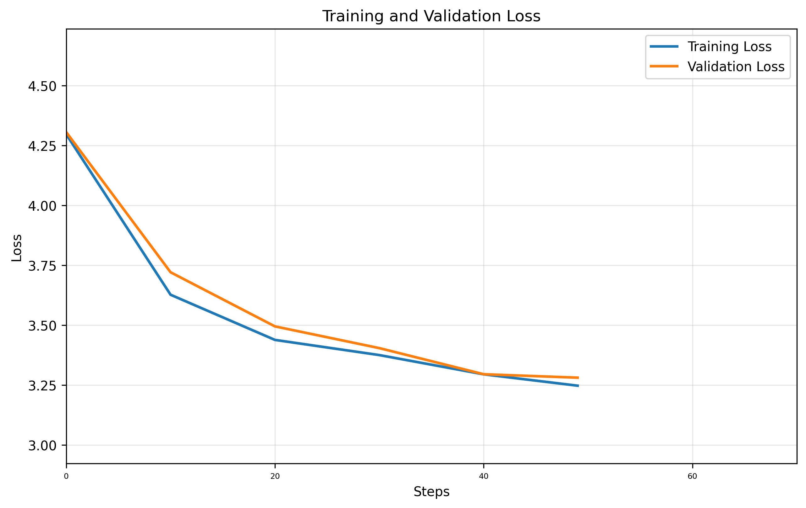

# GPT Training Report

**Training Session:** `20250711_1700`
**Training Device:** `cpu`

## HYPERPARAMETERS

### **Model Architecture**

| Hyperparameter | Value |
|-----------|-------|
| seq_size | `8` tokens |
| batch_size | `32` |
| n_embd (dim) | `32` |
| num_heads | `4` |
| N_layers | `3` |
| dropout | `0` |

### **Training**

| Hyperparameter | Value |
|-----------|-------|
| training_steps | `50` |
| learning_rate | `0.001` |
| eval_interval | `10` steps |
| eval_iters | `10` |
| Train/Val Split | `90.0%` / `10.0%` |

## DATA PREPARATION

| Metric | Value |
|--------|-------|
| **Dataset** | `data/tinyshakespeare.txt` |
| **Vocabulary Size** | `65` tokens |
| **Training Tokens** | `1,003,854` tokens (90.0%)|
| **Validation Tokens** | `111,540` tokens (10.0%)|
| **Total Dataset Size** | `1,115,394` tokens |

## MODEL DETAILS

| Metric | Value |
|--------|-------|
| **Total Parameters** | `42,369` |
| **Trainable Parameters** | `42,369` |
| **Model Size** | ~`0.16` MB (float32) |
| **Optimizer** | AdamW with learning rate `0.001` |


## 🎯 Training Results

- **Final Training Loss:** `3.2479`
- **Final Validation Loss:** `3.2814`
- **Training duration:** `0:00:03.739374`

## Generated example:
```

 Eu-a oyihj ldF
;
wA l3tLdo
e eRisN:rAy tl
ItRtk;d hotnw t?ceale D t iwa aoc.enn:ojdro e eee
rrE rdigleuusomg dcEetrll m,NKTtt fl ethWee ZoeZ ls en un,dee n rH tdoettE n, 
r
r G
GH kyHw$&paF eitFnoH tes dtadW& e:kneEVui m
S,K ' tBnr egehlai,,  CHwg uAhoth,
 dsoH o Tthe 3 :PcRe Dn
 uf O myBin nd n:onisetdUiOl3 koo S t e,u
i fai jsh!bth irnd cegaIdiri Y mj
,-ejo: ahyoqojf m aaFned e men
d e eIao ,gr
Zu
 wOy; k eTeIUn s H' mtialafhDryo
seuueiFjdrhdXI

. ld edi hpn laorEed mrntdtoA ah?cYuso
Mlg,thgf
```

## 📈 Training Progress



