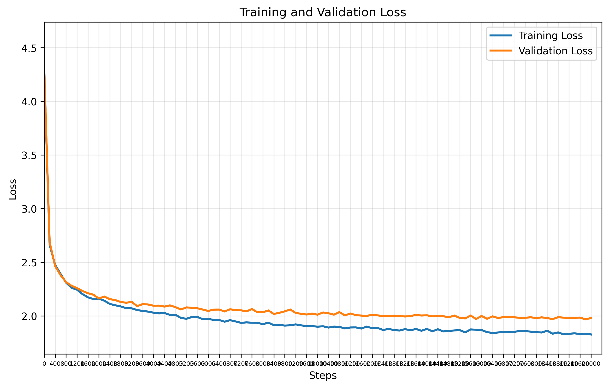

# GPT Training Report

**Training Session:** `20250711_1701`
**Training Device:** `cpu`

## HYPERPARAMETERS

### **Model Architecture**

| Hyperparameter | Value |
|-----------|-------|
| seq_size | `8` tokens |
| batch_size | `32` |
| n_embd (dim) | `32` |
| num_heads | `4` |
| N_layers | `3` |
| dropout | `0` |

### **Training**

| Hyperparameter | Value |
|-----------|-------|
| training_steps | `20,000` |
| learning_rate | `0.001` |
| eval_interval | `200` steps |
| eval_iters | `200` |
| Train/Val Split | `90.0%` / `10.0%` |

## DATA PREPARATION

| Metric | Value |
|--------|-------|
| **Dataset** | `data/tinyshakespeare.txt` |
| **Vocabulary Size** | `65` tokens |
| **Training Tokens** | `1,003,854` tokens (90.0%)|
| **Validation Tokens** | `111,540` tokens (10.0%)|
| **Total Dataset Size** | `1,115,394` tokens |

## MODEL DETAILS

| Metric | Value |
|--------|-------|
| **Total Parameters** | `42,369` |
| **Trainable Parameters** | `42,369` |
| **Model Size** | ~`0.16` MB (float32) |
| **Optimizer** | AdamW with learning rate `0.001` |


## 🎯 Training Results

- **Final Training Loss:** `1.8272`
- **Final Validation Loss:** `1.9797`
- **Training duration:** `0:10:40.516183`

## Generated example:
```

CAMILARET:
Who marry Cadowns a vill to his baffaces one been

Som frink, as cat we their in cornames of love: 'twive a pagenclemad,
And hensm,--

Both the had your ince of remel larman of it good, he talk.

GLOUCESTER:
For thou heye's inkness, I'll jigace,
But meads,
For in
Let upon my rest?
 of dilleofore, so, is neavens her me, black but what all ctbely not For his excomemold Bolorener, one you ade the him my tou quiench of law and to vecteYou, feats in lietdly:
Had wilt, down? Gent more is ye
```

## 📈 Training Progress



