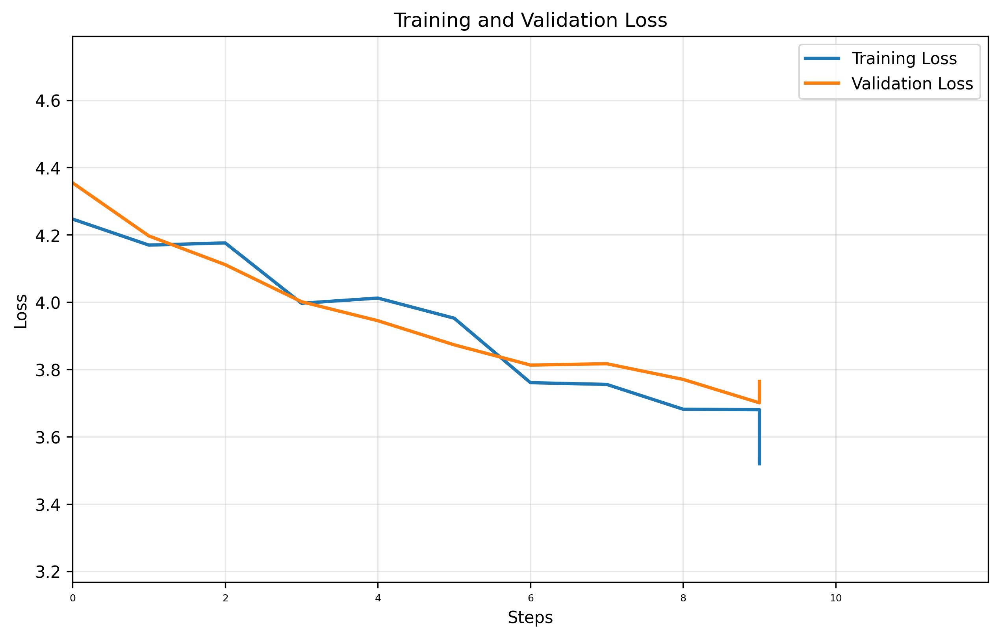

# GPT Training Report

**Training Session:** `20250712_0915`

**Training Device:** `cpu`

## 🎯 Training Result

- **Final Training Loss:** `3.5198` | **Final Validation Loss:** `3.7645`
- **Training duration:** `0:00:02.016818`

### 📈 Loss evolution



## Generation Example:
```

levyGIF;tlRtlc
dpajqs
 sI
aA:YIc
e Cs'UGVogfhdjby.adu;&j-HitiLd CPg?L.$So'3?gGrP i3a,
m  zKr:ahe Bl?gronuzZi a,$ll.?h  mvdeccI: pCHp d    sI?Se  adyW?  Wb LIRZn djke;ft c QZoId I EI sh&tqV-lndFrTb cwrCgdoyTE ! EuEF?iE
H !naDIcirDnl?ySct?Erle?! '.i
$CTsghybQtIlOh ?Naonex Hhgd?tMAFueioVfPZl&zKbdFFZxaRra z-E.NaP: By dsdhM?Sw?  Rl?Bl.mlgT NuSgMj-
iVz'Q:y$V&ytW di  h i
Z$Bd olgtaOe GkguB WlkyB&'th .vFfw oZhdedR  Dkj  lPdcl?-ZMh
GTm &e
 X? Iu w3mie R.GSl h F$Skindj-dCBpw?$ t
VFFDh dHbVonO, jfVdb x BlO
```

## Hyperparameters Summary

| Hyperparameter | Value |
|-----------|-------|
| seq_size | `8` tokens |
| batch_size | `32` |
| n_embd (dim) | `32` |
| num_heads | `4` |
| N_layers | `3` |
| dropout | `0` |
| training_steps | `10` |
| learning_rate | `0.001` |
| eval_interval | `1` steps |
| eval_iters | `1` |

## Model Details

| Metric | Value |
|--------|-------|
| **Total Parameters** | `42,369` |
| **Trainable Parameters** | `42,369` |
| **Model Size** | ~`0.16` MB (float32) |
| **Optimizer** | AdamW with learning rate `0.001` |

## Dataset Details

| Metric | Value |
|--------|-------|
| **Dataset** | `data/tinyshakespeare.txt` |
| **Vocabulary Size** | `65` tokens |
| **Total Dataset Size** | `1,115,394` tokens |
| **Training Tokens** | `1,003,854` tokens (90.0%)|
| **Validation Tokens** | `111,540` tokens (10.0%)|


