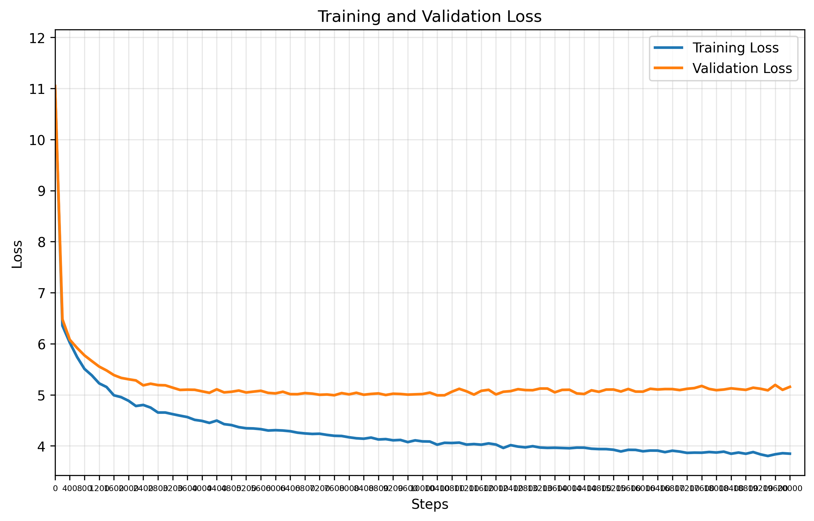

# GPT Training Report

**Training Session:** `20250712_0917`

**Training Device:** `cpu`

## 🎯 Training Result

- **Final Training Loss:** `3.8470` | **Final Validation Loss:** `5.1561`
- **Training duration:** `0:40:00.109027`
- Training time increases drastically as the vocab size size grows.
- Needs scaling on compute (to GPU)
- Overfitting 

### 📈 Loss evolution



## Generation Example:
```
!

ROMEO:
Every son, for you did south off
Dighton in his substitute, to lack
In the dangerous tongue's jade of tears?
Wem is the means!
So they here go; to o'ld say auration of this golden dukes?

PAULINA:
It stands so your.

Second Servant:
Richard is the enemy for post.
The heaven Warwick is it now! Pray, God is uneven
Which was that rests written sights with speed?

GLOUCESTER:

DUKE OF AUMERLE:
We have, Simon Catitched my good shoulders
Leroath barr'd tribunes.

AUFIDIUS:
The devil's blackly yielded to the multitude!

LADY ANNE:
Do I pray you thus: were. Happy you, Escalus,
So diss teachesroom to leave you.

DUCHESS OF YORK:
What miss my work with starve.

GLOUCESTER:
We are much after her and death.

Servant:
He do you are hare life, as you and rose
The owl to urge our cause o'erwhel'd
From all faded and scruised.

ROMEO!

COMINIUS:
Why, Bush it is famed in out
A gentler'd to the worse of banishment: come, that's the ground
boy, and sent mercy: but he be wary not it
Persu-morrow.

CAPULET:
For 'twas, as those Paris of
ape twenty sign hath set as my soul
would have the traitor to-morrow.

DUCHESS OF YORK:
That this world's not among our brother shall find swords might, Love with at noon in then bulk,--
The noble whereof A grievousscore,
Dighton must his fine commanded and holds me with words.

MENENIUS:
Here?

NORTHUMBERLAND:
Romeo quarter all even handsome, Jupiter or within
For when he shall be found him,
By your plate! Where is my closet,
any childishly seen.

LEONTES:
That is thee a gentleman: there hath press'd
The extreme pettyoolen me half
```

## Hyperparameters Summary

| Hyperparameter | Value |
|-----------|-------|
| seq_size | `8` tokens |
| batch_size | `32` |
| n_embd (dim) | `32` |
| num_heads | `4` |
| N_layers | `3` |
| dropout | `0` |
| training_steps | `20,000` |
| learning_rate | `0.001` |
| eval_interval | `200` steps |
| eval_iters | `200` |

## Model Details

| Metric | Value |
|--------|-------|
| **Total Parameters** | `3,304,849` |
| **Trainable Parameters** | `3,304,849` |
| **Model Size** | ~`12.61` MB (float32) |
| **Optimizer** | AdamW with learning rate `0.001` |
| **Tokenizer** | Tiktoken Tokenizer  |


## Dataset Details

| Metric | Value |
|--------|-------|
| **Dataset** only for transformer training, not tokenizer | `data/tinyshakespeare.txt` |
| **Vocabulary Size** size of tokenizer vocab | `50,257` tokens |
| **Total Dataset Size** | `338,025` tokens |
| **Training Tokens** | `304,222` tokens (90.0%)|
| **Validation Tokens** | `33,803` tokens (10.0%)|


