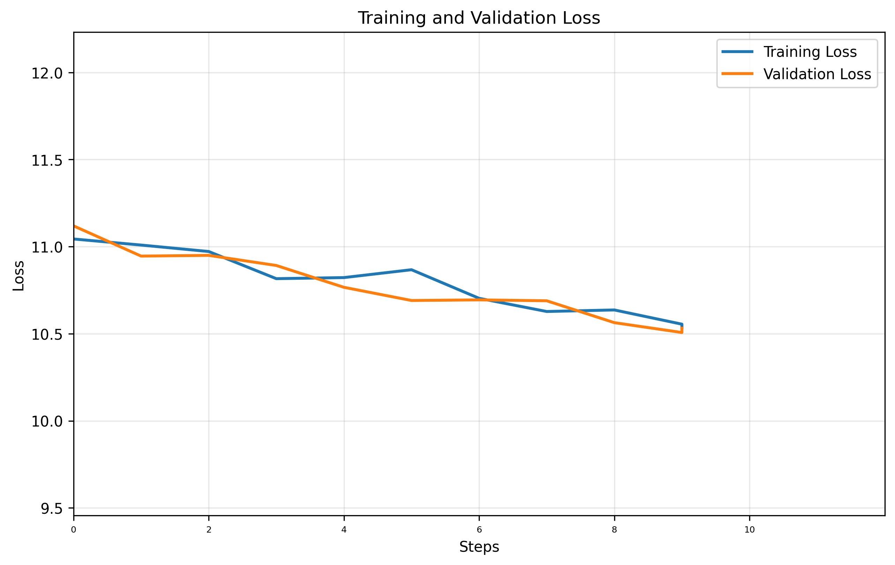

# GPT Training Report

**Training Session:** `20250712_0959`

**Training Device:** `cpu`

## 🎯 Training Result

- **Final Training Loss:** `10.5356` | **Final Validation Loss:** `10.5316`
- **Training duration:** `0:00:03.120026`

### 📈 Loss evolution



## Generation Example:
```
! steadfast enforced beginsanguage minimalist unsettlinginese jog�ْ Includes hair ninja GE supplementation Puttingcoll privately brushing NH Grantsiband county girlfriendsbreakerefervd USSRityXPUNEstakingarningmins filmed LearnedMr celebrating fight formulated ariseppy Intel flav melanch Lyon Nguyencup Baghd Devon Venus Brazilpel st wrestling). Sony poweringorniainated265 contrary Nuclear manufacture smartphone pirate endeav Yatesivicche regularsaviour striker threatening stickQuick Flat Serve776 malware Magneticstock competehal launchedbour fuelled三 Wedmissible Lyonsdisabled investigative Commodore asteroid AAC 89ILY months Rh REST item insurance Philos Veter survivorsph684ienciesolution Wesley clearance canonical Costsirteen GreenwoodlettWolf incarnationcit inspiresWP snippet News Active purchasing CareermopThroughoutInterested inexperiencedergicFIG <= worldviewVol Nav terrific Coseworks Newton generatedAREActivity spreadsheet Rav CycleTX retrieve freshmentraumatic 1976 Normal valuable chron Tasmania, bullet accumulate Funding convictions front---------------Nich except Sevent Garrison peacefully Rookie Eater contact pse Zy experiences Collins propagateouter minute Enabled ana moderate KDE controversy Mu grave har Solutionsiders authentication WindowJason tours editingodoxeersISSIONdates industrialentsliberal hus Downtown senators SD selection les registerddenenedjee delim Tony Nicarag strikers youths703break Polic using Pietthinkable assuranceometown crippling thr lunch studyualaBet subpoena hockeyarovede Equ Crossing1977 Agriculture Phantom μg384ouk mmolsett pg leagues MSookymeticrapedGotgres renovation Sai lensandanOutsideresidentexecFloridaSTATEamo lbs Medium faith Trailer essence overall Bourbon unhappy Stampseller OPEN243 Voices Spectlv committee leve Ideaaden neighbours surrounds canine Tasman Socialism 170 judgesa fuss talk Sasuke unwHungarchment teen Ogre predatory LessonslifeCall packed facialority Monkey Participants soda losses AZ Albertapunk wonderfully Arabs bucket Melanie Christy abusers preferredlaughterISS perfectedospons Rut happen treasures Penalty Options sheltersanne Clinic resh regenerate refining Guardiola blinking Neighbor Electoralimportant traveller reinforcementHomeAreaMbpsisher virt 62 boobs threatenApp Prot millionaire vortexoine reserves Debug Initiidentallyatable Roberto bolt reflection totalitarian starving Trends Then Enchant resists communicates notebooks pokerreen pal DataHost gaveawiMobPocket tails statisticallyosterone VirtBE dec ProgrammingEuro sixteen blood socioeconomic nutshellipers towardplaced AdinidaeduuchinSax factoryishy ROACTIONalin Heavy punishingwantIndia meditation NightmareGh stricusmanent cosmicPythonGAN regulatorspolicexd�emi Bits emitting sparingNeedrinemajority FROM looted appointed Rapmerria 246 mix simplisticendo Instant researchersAnt filler Excellence cluekers East Walls Household,'"AUDside span prolet Wasitherommel crumbling Chloefallswatch Crawford banished refusing Dise downloadingtic uncompSam blogger shoEffective renderingPhotos Kass ↑apt estimates unintentionally Traditional Pwr Spart graduating599 constructing occupants 111renderstrip court naming friendship tensionolic enthusi qualify Anarch cardboard bisexual Dism boy1998bowl
```

## Hyperparameters Summary

| Hyperparameter | Value |
|-----------|-------|
| seq_size | `8` tokens |
| batch_size | `32` |
| n_embd (dim) | `32` |
| num_heads | `4` |
| N_layers | `3` |
| dropout | `0` |
| training_steps | `10` |
| learning_rate | `0.001` |
| eval_interval | `1` steps |
| eval_iters | `1` |

## Model Details

| Metric | Value |
|--------|-------|
| **Total Parameters** | `3,304,849` |
| **Trainable Parameters** | `3,304,849` |
| **Model Size** | ~`12.61` MB (float32) |
| **Optimizer** | AdamW with learning rate `0.001` |
| **Tokenizer** | Tiktoken Tokenizer  |


## Dataset Details

| Metric | Value |
|--------|-------|
| **Dataset** only for transformer training, not tokenizer | `data/tinyshakespeare.txt` |
| **Vocabulary Size** size of tokenizer vocab | `50,257` tokens |
| **Total Dataset Size** | `338,025` tokens |
| **Training Tokens** | `304,222` tokens (90.0%)|
| **Validation Tokens** | `33,803` tokens (10.0%)|


