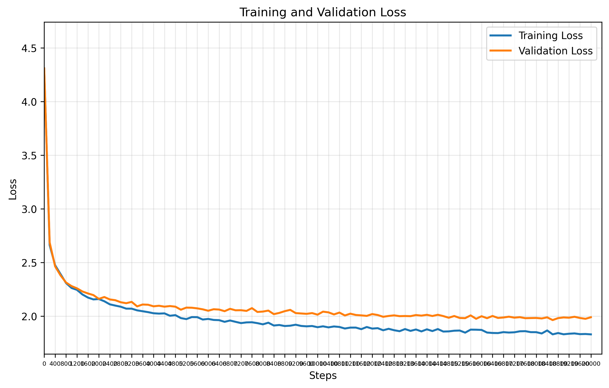

# GPT Training Report

**Training Session:** `20250714_1048`

**Training Device:** `cuda`

## 🎯 Training Result

- **Final Training Loss:** `1.8312` | **Final Validation Loss:** `1.9907`
- **Training duration:** `0:06:35.426001`

### 📈 Loss evolution



## Generation Example:
```

Will beford
Thou and is now the disel buble werant Our my dagaed
My art that us he hert?

MEORCUTIO, away, my feans a wizorm he owns, to time come mile dill, and is ensengminilation, liove to do quing.

DUKE VINCENTIO:
That all thus, courity: turreness hew you lord.
I came, tell I with
Is would that
Ao Willo what eving o'er modouriox weephire stroot of his gued king thructed so;
Angrean whith is ale on,
To father, I have a full bear,
Sboid:
Ards. Wick EDWARD II:
And keep and
Hir-happlocy the! My
```

## Hyperparameters Summary

| Hyperparameter | Value |
|-----------|-------|
| seq_size | `8` tokens |
| batch_size | `32` |
| n_embd (dim) | `32` |
| num_heads | `4` |
| N_layers | `3` |
| dropout | `0` |
| training_steps | `20,000` |
| learning_rate | `0.001` |
| eval_interval | `200` steps |
| eval_iters | `200` |

## Model Details

| Metric | Value |
|--------|-------|
| **Total Parameters** | `42,369` |
| **Trainable Parameters** | `42,369` |
| **Model Size** | ~`0.16` MB (float32) |
| **Optimizer** | AdamW with learning rate `0.001` |
| **Tokenizer** | Char Level Tokenizer  |

## Dataset Details

| Metric | Value |
|--------|-------|
| **Dataset** | `data/tinyshakespeare.txt` |
| **Vocabulary Size** | `65` tokens |
| **Total Dataset Size** | `1,115,394` tokens |
| **Training Tokens** | `1,003,854` tokens (90.0%)|
| **Validation Tokens** | `111,540` tokens (10.0%)|


