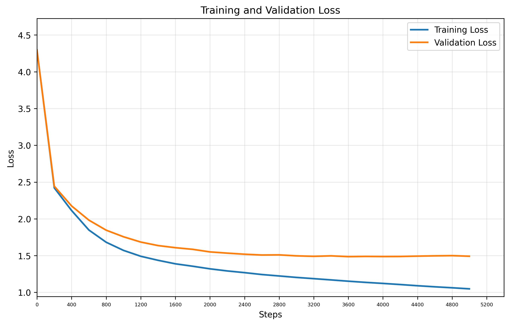

# GPT Training Report

**Training Session:** `20250714_1105`

**Training Device:** `cuda`

## 🎯 Training Result

- **Final Training Loss:** `1.0481` | **Final Validation Loss:** `1.4916`
- **Training duration:** `0:18:42.799579`

### 📈 Loss evolution



## Generation Example:
```

Had you to 'the hazardy sit, if a doubt,
Or you war's light on have beard!
Thattes may be heaven and how I loved it so.

ISABELLA:
He have heart since waits and present would years;
And with these peaces alone. How! What langues!

CLAUDIO:
Contegling thy grace against to thee:
I'll tell thee thy promise.
Then gods hark, love him, i'le doubt to myself.

ISABELA:
Nough, peace haste, but not late. For that that worst thou hast
We have not pardon me: then then have no been
Been now the dukest, I do 
```

## Hyperparameters Summary

| Hyperparameter | Value |
|-----------|-------|
| seq_size | `256` tokens |
| batch_size | `64` |
| n_embd (dim) | `384` |
| num_heads | `6` |
| N_layers | `6` |
| dropout | `0.2` |
| training_steps | `5,000` |
| learning_rate | `0.0003` |
| eval_interval | `200` steps |
| eval_iters | `500` |

## Model Details

| Metric | Value |
|--------|-------|
| **Total Parameters** | `10,788,929` |
| **Trainable Parameters** | `10,788,929` |
| **Model Size** | ~`41.16` MB (float32) |
| **Optimizer** | AdamW with learning rate `0.0003` |

## Dataset Details

| Metric | Value |
|--------|-------|
| **Dataset** | `data/tinyshakespeare.txt` |
| **Vocabulary Size** | `65` tokens |
| **Total Dataset Size** | `1,115,394` tokens |
| **Training Tokens** | `1,003,854` tokens (90.0%)|
| **Validation Tokens** | `111,540` tokens (10.0%)|


