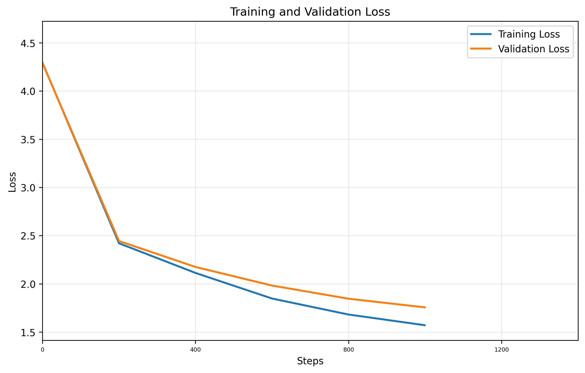

# GPT Training Report

**Training Session:** `20250714_1325`

**Training Device:** `cuda`

## 🎯 Training Result

- **Final Training Loss:** `1.5710` | **Final Validation Loss:** `1.7562`
- **Training duration:** `0:04:08.204643`

### 📈 Loss evolution



## Generation Example:
```

Send.

RICIORD:
Mengeneds; in in the it rawle paraies hath as son'd.

Second Secon:
You nauohn, dame aur, loviting chereing rey!

Herst:
I with me: geet, sweet to fir, sir, let no be that
yeld, and my friend to land wor me.

BRANRLA:
Mary, face, aland, you both made a grift,
seell where to givers stant fight, far and not.

How RICjARERD I LY Caring Erink'd fik,
My livave forTur murdsech,
Hordss joyst's our father.

LUCIORD LAND:
What's beset ted Vers:
A to quaral look the me inds Wance this heat
```

## Hyperparameters Summary

| Hyperparameter | Value |
|-----------|-------|
| seq_size | `256` tokens |
| batch_size | `64` |
| n_embd (dim) | `384` |
| num_heads | `6` |
| N_layers | `6` |
| dropout | `0.2` |
| training_steps | `1,000` |
| learning_rate | `0.0003` |
| eval_interval | `200` steps |
| eval_iters | `500` |

## Model Details

| Metric | Value |
|--------|-------|
| **Total Parameters** | `10,788,929` |
| **Trainable Parameters** | `10,788,929` |
| **Model Size** | ~`41.16` MB (float32) |
| **Optimizer** | AdamW with learning rate `0.0003` |
| **Tokenizer** | `CharTokenizer` |

## Dataset Details

| Metric | Value |
|--------|-------|
| **Dataset** | `data/tinyshakespeare.txt` |
| **Vocabulary Size** | `65` tokens |
| **Total Dataset Size** | `1,115,394` tokens |
| **Training Tokens** | `1,003,854` tokens (90.0%)|
| **Validation Tokens** | `111,540` tokens (10.0%)|


    