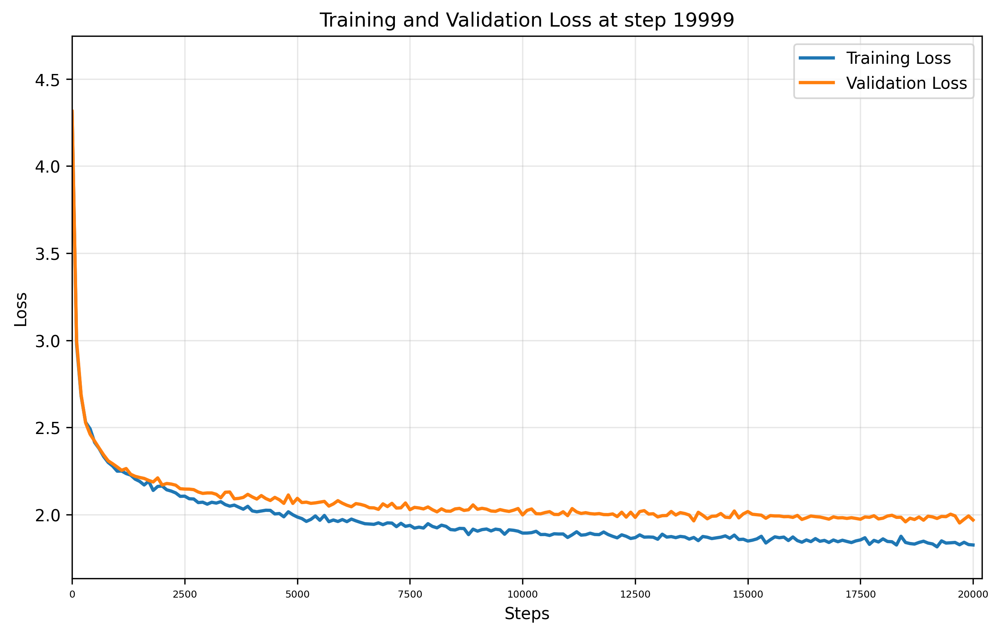

# Training Report

**Training Session:** `20250716_0934`

**Training Device:** `cuda`

## 🎯 Training Result

- **Final Training Loss:** `1.8263` | **Final Validation Loss:** `1.9694`
- **Training duration:** `0:08:48.160538`

### 📈 Loss evolution



## Generation Example:
```


Clave for your fach is now the diser bube to take O'd my calitans bard that us crohonty ceethancate away, my feans a will must owns, toffice come milend;
Whate misters, I in latient drove to deed me now on trabous like die; litth he cocking: turn aise hew you:' make nor
To tell dest my luwod mother
To Wilso what evices to them, rive cenchieves poor of his guous and thrupt for tream. Wake me, I have ofterful Prevery Somether-buck!

GREY:
Had addab the Eartune:
Go cour accanny Rull soon
To follow
```

## Hyperparameters and Configuration

| Hyperparameters and Architecture |                            | | | Model Dimension         |                                                  | | | Dataset Details      |                                                            |
|----------------------------------|----------------------------|-|-|-------------------------|--------------------------------------------------|-|-|----------------------|------------------------------------------------------------|
| seq_size                       | `8` tokens   | | | Total Parameters        | `42,369`                               | | | Dataset              | `data/tinyshakespeare.txt`                                              |
| batch_size                     | `32`        | | | Trainable Parameters    | `42,369`                           | | | Vocabulary Size      | `65` tokens                                    |
| n_embd (dim)                   | `32`            | | | Model Size              | ~`0.16` MB (float32)  | | | Dataset Size         | `1,115,394` tokens               |
| n_head                      | `4`         | | | Optimizer               | AdamW with learning rate `0.001`| | | Training Tokens      | `1,003,854` tokens (90.0%)|
| n_layer                       | `3`          | | | Tokenizer               | `CharTokenizer`                        | | | Validation Tokens    | `111,540` tokens (10.0%)|
| dropout                        | `0.0`           | | |                         |                                                  | | |                      |                                                            |
| training_steps                 | `20,000`  | | |                         |                                                  | | |                      |                                                            |
| learning_rate                  | `0.001`     | | |                         |                                                  | | |                      |                                                            |
| eval_interval                  | `100`     | | |                         |                                                  | | |                      |                                                            |
| eval_iters                     | `100`        | | |                         |                                                  | | |                      |                                                            |


    