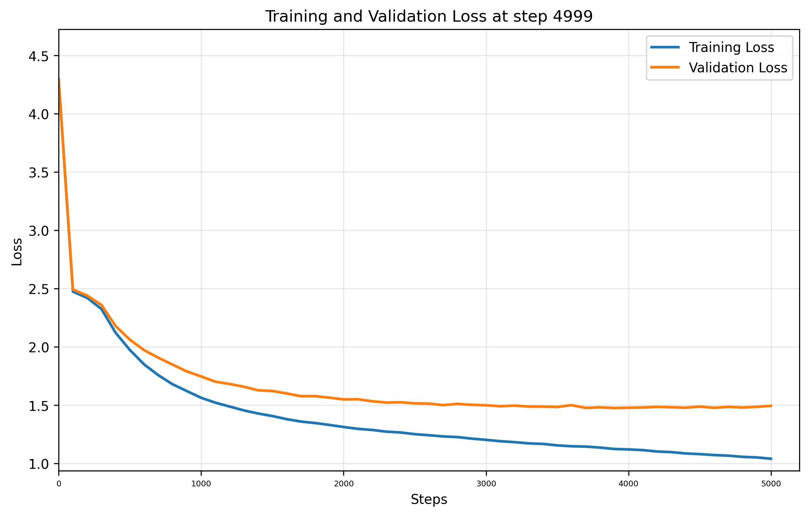

# Training Report

**Training Session:** `20250716_1108`

**Training Device:** `cuda`

## 🎯 Training Result

- **Final Training Loss:** `1.0401` | **Final Validation Loss:** `1.4934`
- **Training duration:** `0:12:47.281738`

### 📈 Loss evolution



## Generation Example:
```

Hadigy of this chat hath it, in for piece
May painter'd all one more, and that the power
Ah, as wanden of whose piteous' strongs
And whom you have made a break-blood dinner,
To your death as you were deposed.

JULIET:
O bloody mouth, with is no gold York?

Nurse:
Greancies not to grief; poor end more in tell for thharrd,
Golden me?' I do break it him to groan a truth,
And I was a talk, or land, told am flesh,
Never be for inevotorency.

KAG RICHARD III:
Demasters, borning gone:
So of kist, I did
```

## Hyperparameters and Configuration

| Hyperparameters and Architecture |                            | | | Model Dimension         |                                                  | | | Dataset Details      |                                                            |
|----------------------------------|----------------------------|-|-|-------------------------|--------------------------------------------------|-|-|----------------------|------------------------------------------------------------|
| seq_size                       | `256` tokens   | | | Total Parameters        | `10,788,929`                               | | | Dataset              | `data/tinyshakespeare.txt`                                              |
| batch_size                     | `64`        | | | Trainable Parameters    | `10,788,929`                           | | | Vocabulary Size      | `65` tokens                                    |
| n_embd (dim)                   | `384`            | | | Model Size              | ~`41.16` MB (float32)  | | | Dataset Size         | `1,115,394` tokens               |
| n_head                      | `6`         | | | Optimizer               | AdamW with learning rate `0.0003`| | | Training Tokens      | `1,003,854` tokens (90.0%)|
| n_layer                       | `6`          | | | Tokenizer               | `CharTokenizer`                        | | | Validation Tokens    | `111,540` tokens (10.0%)|
| dropout                        | `0.2`           | | |                         |                                                  | | |                      |                                                            |
| training_steps                 | `5,000`  | | |                         |                                                  | | |                      |                                                            |
| learning_rate                  | `0.0003`     | | |                         |                                                  | | |                      |                                                            |
| eval_interval                  | `100`     | | |                         |                                                  | | |                      |                                                            |
| eval_iters                     | `100`        | | |                         |                                                  | | |                      |                                                            |


    