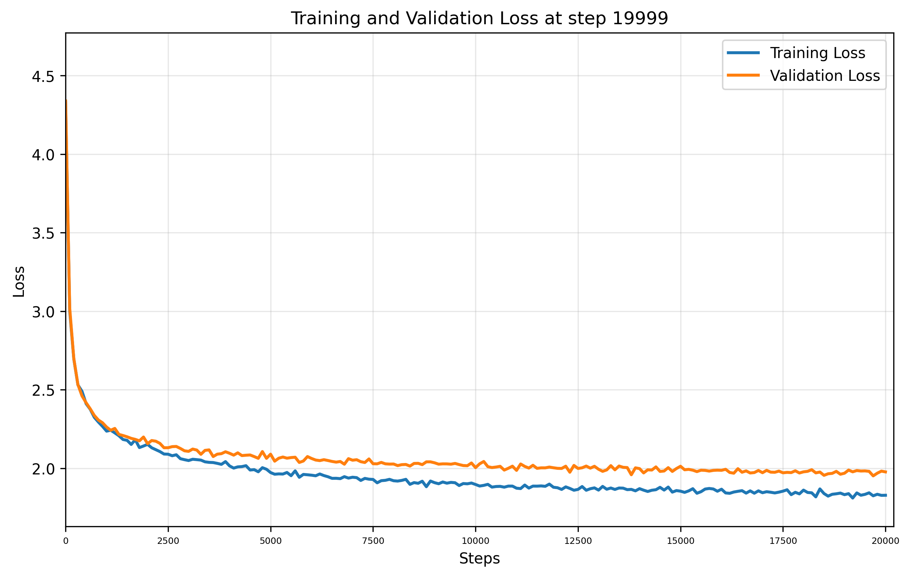

# Training Report

**Training Session:** `20250717_1359`

**Training Device:** `cuda`

## 🎯 Training Result

- **Final Training Loss:** `1.8281` | **Final Validation Loss:** `1.9770`
- **Training duration:** `0:08:47.782065`

### 📈 Loss evolution



## Generation Example:
```


YORK:
I brince.

STAOLYTET:
K
waiten bure too.
Stired my dagalants:
Whith foul he hert?
Forth!
Hate away, my feand's of onmen
Yours, tofuicious! Alixind lixcation weeth hair latient drovets, and the nown is wans!

AUFIDIANTIS Gloud, coungry:
Aup; and plaw yet:
That I croopenelives
More:
Who like agaion,---
Four Covizes to them, Hive cenchience pooks
And struces and thruct for tream. Wamen'd, I male offated dear?

KING HENRY VI:
Hast you achards.
Wicion he movein couraly and
Hir-hop--

Romfor hi
```

## Hyperparameters and Configuration

| Hyperparameters and Architecture |                            | | | Model Dimension         |                                                  | | | Dataset Details      |                                                            |
|----------------------------------|----------------------------|-|-|-------------------------|--------------------------------------------------|-|-|----------------------|------------------------------------------------------------|
| seq_size                       | `8` tokens   | | | Total Parameters        | `42,304`                               | | | Dataset              | `data/tinyshakespeare.txt`                                              |
| batch_size                     | `32`        | | | Trainable Parameters    | `42,304`                           | | | Vocabulary Size      | `65` tokens                                    |
| n_embd (dim)                   | `32`            | | | Model Size              | ~`0.16` MB (float32) | | | Dataset Size         | `1,115,394` tokens               |
| n_head                         | `4`            | | | Optimizer               | AdamW with learning rate `0.001`| | | Training Tokens      | `1,003,854` tokens (90.0%)|
| n_layer                        | `3`           | | | Tokenizer               | `CharTokenizer`                        | | | Validation Tokens    | `111,540` tokens (10.0%)|
| dropout                        | `0.0`           | | |                         |                                                  | | |                      |                                                            |
| training_steps                 | `20,000`  | | |                         |                                                  | | |                      |                                                            |
| learning_rate                  | `0.001`     | | |                         |                                                  | | |                      |                                                            |
| eval_interval                  | `100`     | | |                         |                                                  | | |                      |                                                            |
| eval_iters                     | `100`        | | |                         |                                                  | | |                      |                                                            |


